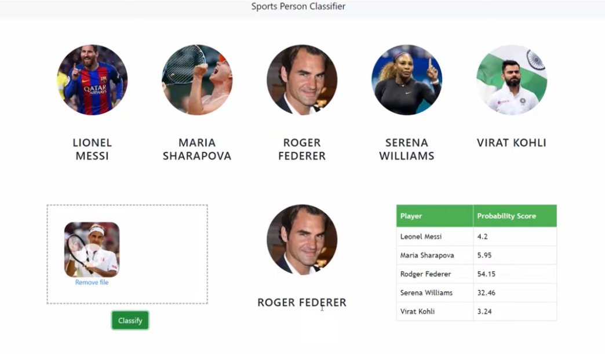

# 🏅 Sports Person Classification

This project uses **deep learning** to classify images of sportspersons into their respective sports categories.  
It is built with **Python, Jupyter Notebook, and Deep Learning frameworks (PyTorch/TensorFlow)** and includes a client, model, and server module.

---

## 🚀 Features
- Image classification using CNN / Transfer Learning
- Preprocessing: resizing, normalization, augmentation
- Training & evaluation with accuracy, loss, and confusion matrix
- Predict on new images
- API / server setup for model inference
- Client for easy interaction with the model

---

## 📂 Project Structure
SportsPersonClassification/
│── client/ # Frontend or user interface
│── model/ # Training, evaluation, prediction scripts
│── server/ # Backend / API for inference
│── requirements.txt
│── README.md


---

## 🖼️ Screenshots

---

## ⚙️ Installation Guide

### 1️⃣ Clone the Repository
```bash
git clone https://github.com/Sharvari-21/SportsPersonClassification.git
cd SportsPersonClassification
